# Labwork Rubric 2 - Snort Installation #

**Individual/Group Members:** 
- **Author:** Ezekiel Mukhriz
- **Partner:** Muhammad Aabas
- **Semester:** Sem 4 / NWS
- **TTO:** Miss Dahlia

---

## Answer all questions: ##

### 1. Explain the basic requirement of the SNORT installation. You may use diagram/screenshot to support your explanation. ### 
= To install and configure Snort on OpenSUSE 15.4 within a VMWare virtual machine, the following are required:-

System Requirements:
- VMWare Workstation 17.5.0 (Virtualization Platform)
- Host OS: Kali Linux 2024.4
- Guest OS: OpenSUSE Leap 15.4
- Snort Version: 2.9.20
- DAQ Version: 2.0.7

Installation Steps:
1. Install Dependencies:
```bash
- sudo zypper install gcc gcc-c++ libpcap libpcap-devel libdnet-devel flex bison
```

2. Download and Install DAQ:
```bash
wget https://www.snort.org/downloads/snort/daq-2.0.7.tar.gz
tar -xzf daq-2.0.7.tar.gz
cd daq-2.0.7
./configure && make && sudo make install
```

3. Download and Install Snort:
```bash
- wget https://www.snort.org/downloads/snort/snort-2.9.20.tar.gz
- tar -xzf snort-2.9.20.tar.gz
- cd snort-2.9.20
- ./configure --enable-sourcefire && make && sudo make install
```

4. Verify Installation:
```bash
- snort -V
```

### 2. Explain your expectation from this lab. What is your achievement before and after lab completion? ###
**Before the Lab:** Expected to learn how to install and configure Snort properly, create rules, and analyze network traffic.
**After the Lab:** Successfully installed Snort, created rules, detected attacks (ICMP, HTTP, SSH, Nmap, Hydra), and logged alerts.

### 3. Did you able to complete the lab successfully (YES/NO)? Explain why and how.  Demonstrate and explain the output you achieve from this lab. (Explanation at least in 10 points) ###
= Yes, the lab was completed successfully.
However, there were issues with alert logging initially, which were resolved by:
- Checking Snort Configuration: Ensuring output unified2 was set correctly in snort.conf.
- Verifying Permissions: Running Snort as snort user.
- Using the Correct Interface: snort -c /etc/snort/snort.conf -i eth0 -A console.

Demonstration output:
1. ICMP Attack Detected:
 

2. HTTP Traffic Detected:
 

3. SSH Attempt Detected:
 

4. Nmap Scan Detected:
 

5. Hydra Scan Detected:
  

### 4. Interpret the result and your findings? Your explanation may include the result of your SNORT and how you elaborate the findings. ###
- Snort detected attacks based on configured rules.
- Alert logging issues were due to output unified2 misconfiguration.
- Hydra brute force detected after 5 attempts in 60 seconds.
- Rules differentiate attacks by protocol, port, flags, and behaviour.
- tcpdump confirmed attack detection.
Rules that I put in ‘local.rules’:
  

---

## About This Guide ##
This guide has been tested on **OpenSuSE15.4** VMWare, 64 bits, using **DAQ 2.0.7** and **Snort 2.9.20**.
Software was installed in a virtual machine:
- Virtual Machine Manager: VMWare Work Station 17.5.0
- HOST operating system: kali-linux-2024.4-vmware-amd64
- GUEST operating system: openSUSE Leap 15.4 (Snort will be installed here)

---

## Network Card Configuration ##
Run VMWare manager and configure the **‘Network Adapter’** of the guest machine to
**‘Bridged (Automatic)'** mode.
 

---

## Guest Machine ##
Start your guest machine and set its network interface card to a static IP, for example: 192.168.234.5, then check settings:
```bash
ifconfig
```


---

## Snort Installation Guide ##

### 🔹 Step 1: Prerequisites ###

1. Before installing Snort, ensure you have the necessary dependencies by running:
```bash
sudo zypper install gcc gcc-c++ make flex bison libpcap-devel pcre pcre-devel libdnet-devel zlib-devel luajit luajit-devel libopenssl-devel libtirpc-devel
```

📷 Screenshot:
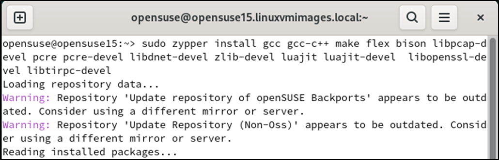

2. The configure command must end with the following:

📷 Screenshot:
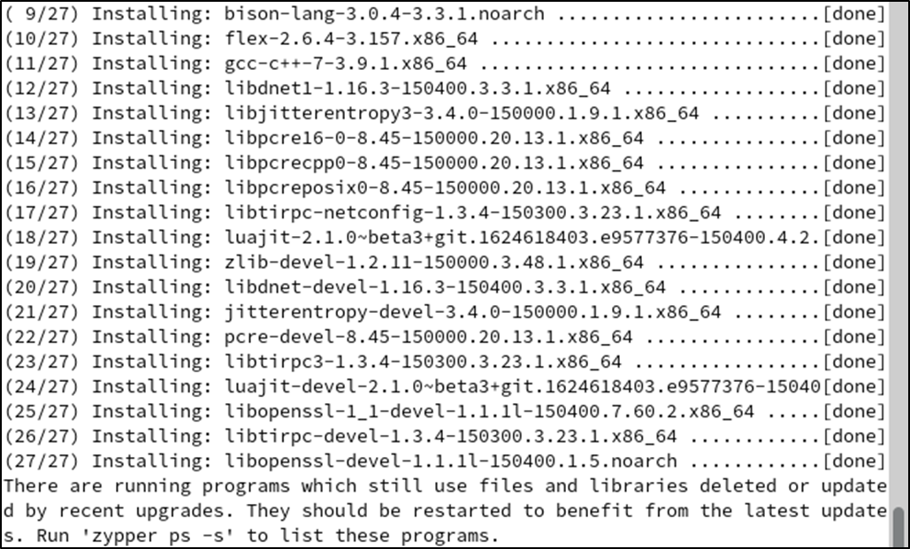 

 ### 🔹 Step 2: Downloading Required Files ###

1. Navigate to the Downloads directory:
```bash
cd ~/Downloads
```

📷 Screenshot:
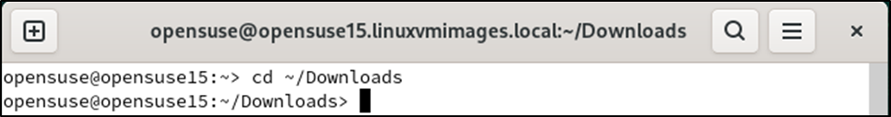 

2. Download the required packages:
```bash
wget -c https://snort.org/downloads/snort/daq-2.0.7.tar.gz
```

📷 Screenshot:
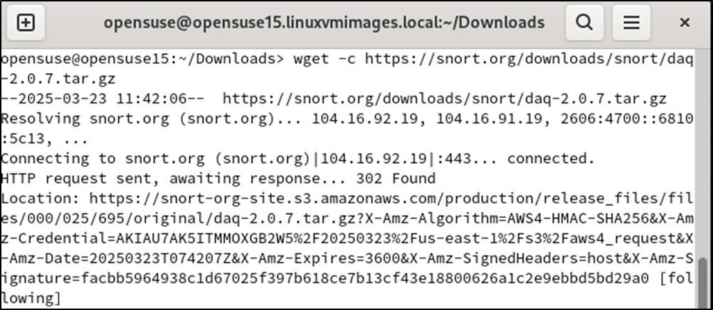  

```bash
wget -c https://snort.org/downloads/snort/snort-2.9.20.tar.gz 
```

📷 Screenshot:
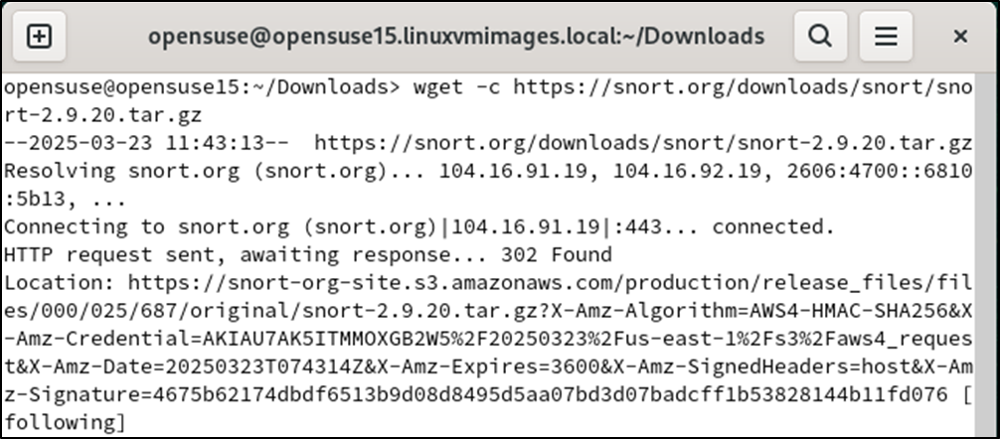   

### 🔹 Step 3: Extracting Files ###

1. Switch to the root user:
```bash
sudo su
```

📷 Screenshot:
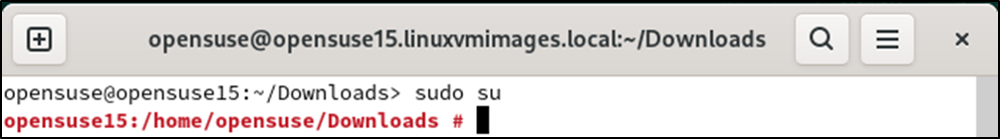  

2. Move to the source directory:
```bash
cd /usr/local/src
```

📷 Screenshot:


3. Extract the downloaded tar files:
```bash
tar -xzf /home/opensuse/Downloads/daq-2.0.7.tar.gz
tar -xzf /home/opensuse/Downloads/snort-2.9.20.tar.gz
```

📷 Screenshot:
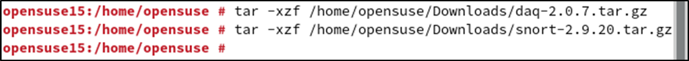

### 🔹 Step 4: Installing DAQ (Data Acquisition Library) ###

1. Navigate to the DAQ directory:
```bash
cd /usr/local/src/daq-2.0.7/
```

📷 Screenshot:
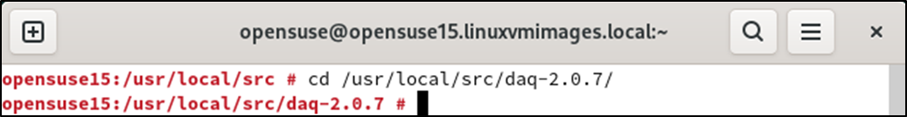 

2. Run the following commands to configure and install DAQ:
```bash
./configure
```

📷 Screenshot:
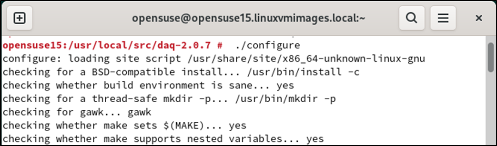  

3. The configure command must end with the following:

📷 Screenshot:
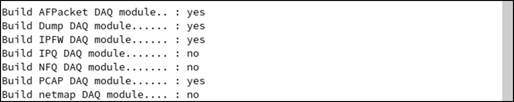  

```bash
make
```

📷 Screenshot:
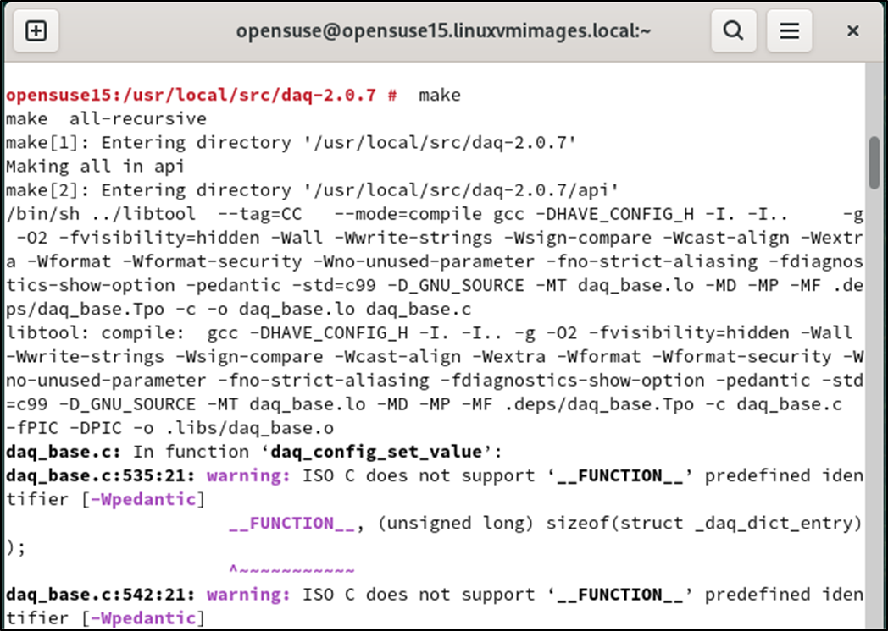 

4. The configure command must end with the following:

📷 Screenshot:
  

```bash
make install
```

📷 Screenshot:
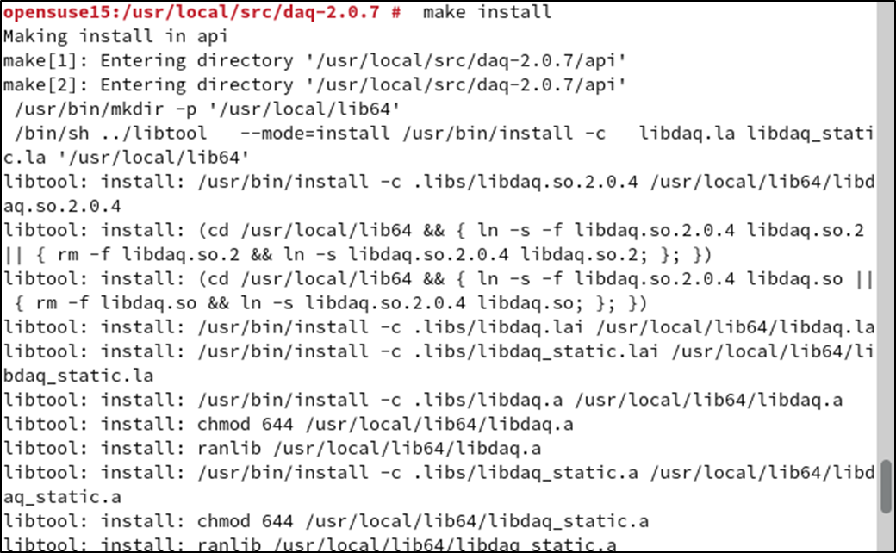  

### 🔹 Step 5:  ###


